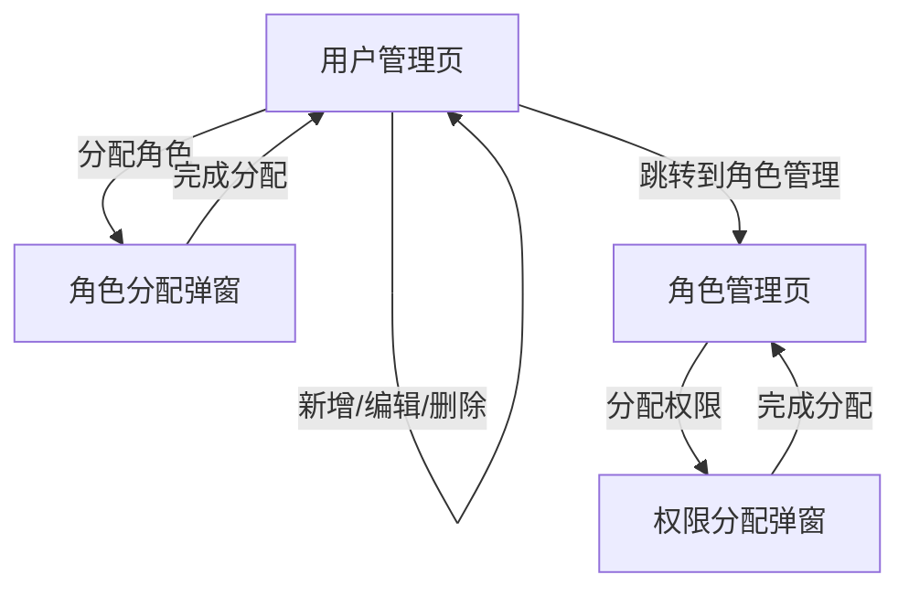

# RBAC 权限系统操作步骤

本文档详细说明了 RBAC 权限系统的操作流程，包括管理员登录、用户管理、角色管理、权限分配等步骤。

## 1. 管理员登录

管理员登录后可以访问所有菜单和功能。

### 1.1 登录接口

- **URL**: `/api/auth/login`
- **Method**: `POST`
- **请求体**:

```json
{
  "username": "admin",
  "password": "admin123"
}
```

- **响应**:

```json
{
  "success": true,
  "message": "登录成功",
  "data": {
    "accessToken": "eyJhbGciOiJIUzI1NiIsInR5cCI6IkpXVCJ9...",
    "refreshToken": "eyJhbGciOiJIUzI1NiIsInR5cCI6IkpXVC..."
  }
}
```

### 1.2 获取用户信息

登录成功后，系统会自动获取用户信息，包括菜单和权限。

- **URL**: `/api/users/me`
- **Method**: `GET`
- **响应**:

```json
{
  "success": true,
  "message": "Success",
  "data": {
    "user": {
      "id": 1,
      "username": "admin",
      "email": "admin@example.com",
      "status": 1
    },
    "roles": [
      {
        "id": 1,
        "name": "超级管理员",
        "code": "admin"
      }
    ],
    "routes": [
      {
        "id": 1,
        "name": "系统管理",
        "path": "/system",
        "component": "Layout",
        "meta": {
          "title": "系统管理",
          "icon": "系统"
        },
        "children": [
          {
            "id": 2,
            "name": "用户管理",
            "path": "user",
            "component": "system/user/index",
            "meta": {
              "title": "用户管理",
              "icon": "用户"
            }
          },
          {
            "id": 3,
            "name": "角色管理",
            "path": "role",
            "component": "system/role/index",
            "meta": {
              "title": "角色管理",
              "icon": "角色"
            }
          }
        ]
      }
    ],
    "permissions": [
      "system:user:add",
      "system:user:edit",
      "system:user:delete",
      "system:user:view",
      "system:role:add",
      "system:role:edit",
      "system:role:delete",
      "system:role:assign",
      "system:resource:add",
      "system:resource:edit",
      "system:resource:delete"
    ]
  }
}
```

## 2. 创建新用户

### 2.1 创建用户接口

- **URL**: `/api/users`
- **Method**: `POST`
- **请求体**:

```json
{
  "username": "testuser",
  "password": "test123",
  "email": "test@example.com",
  "roleIds": [] // 初始不分配角色
}
```

- **响应**:

```json
{
  "success": true,
  "message": "User created successfully",
  "data": {
    "id": 2,
    "username": "testuser",
    "email": "test@example.com",
    "status": 1,
    "roles": []
  }
}
```

## 3. 创建角色

在给用户分配角色之前，需要先创建角色。

### 3.1 创建角色接口

- **URL**: `/api/roles`
- **Method**: `POST`
- **请求体**:

```json
{
  "name": "普通用户",
  "code": "user",
  "description": "普通用户角色",
  "permissionIds": [], // 初始不分配权限
  "resourceIds": [] // 初始不分配资源
}
```

- **响应**:

```json
{
  "success": true,
  "message": "Role created successfully",
  "data": {
    "id": 2,
    "name": "普通用户",
    "code": "user",
    "description": "普通用户角色",
    "permissions": [],
    "resources": []
  }
}
```

## 4. 分配权限

### 4.1 创建资源（菜单和按钮）

首先创建菜单资源，然后创建对应的按钮资源。

#### 4.1.1 创建菜单资源

- **URL**: `/api/resources`
- **Method**: `POST`
- **请求体**:

```json
{
  "name": "用户管理",
  "code": "system:user",
  "path": "user",
  "component": "system/user/index",
  "type": "menu",
  "parentId": 1, // 父级菜单ID
  "meta": {
    "title": "用户管理",
    "icon": "用户",
    "noCache": false
  }
}
```

- **响应**:

```json
{
  "success": true,
  "message": "Resource created successfully",
  "data": {
    "id": 2,
    "name": "用户管理",
    "code": "system:user",
    "path": "user",
    "component": "system/user/index",
    "type": "menu",
    "parentId": 1,
    "meta": {
      "title": "用户管理",
      "icon": "用户",
      "noCache": false
    }
  }
}
```

#### 4.1.2 创建资源操作

- **URL**: `/api/resource-actions`
- **Method**: `POST`
- **请求体**:

```json
{
  "name": "查看用户",
  "code": "view",
  "description": "查看用户列表",
  "icon": "查看",
  "sort": 1,
  "resourceId": 2 // 关联到用户管理资源
}
```

- **响应**:

```json
{
  "success": true,
  "message": "Resource action created successfully",
  "data": {
    "id": 1,
    "name": "查看用户",
    "code": "system:user:view",
    "description": "查看用户列表",
    "icon": "查看",
    "sort": 1,
    "resourceId": 2,
    "permission": {
      "id": 1,
      "name": "system:user:view",
      "code": "system:user:view",
      "description": "查看用户列表"
    }
  }
}
```

### 4.2 为角色分配权限

- **URL**: `/api/roles/:id/permissions`
- **Method**: `PUT`
- **请求体**:

```json
{
  "permissionIds": [1, 2, 3] // 权限ID列表
}
```

- **响应**:

```json
{
  "success": true,
  "message": "Permissions assigned successfully",
  "data": {
    "id": 2,
    "name": "普通用户",
    "code": "user",
    "permissions": [
      {
        "id": 1,
        "name": "system:user:view",
        "code": "system:user:view"
      },
      {
        "id": 2,
        "name": "system:user:add",
        "code": "system:user:add"
      },
      {
        "id": 3,
        "name": "system:user:edit",
        "code": "system:user:edit"
      }
    ]
  }
}
```

## 5. 给用户分配角色

### 5.1 分配角色接口

- **URL**: `/api/users/:id/roles`
- **Method**: `PUT`
- **请求体**:

```json
{
  "roleIds": [2] // 角色ID列表
}
```

- **响应**:

```json
{
  "success": true,
  "message": "Roles assigned successfully",
  "data": {
    "id": 2,
    "username": "testuser",
    "roles": [
      {
        "id": 2,
        "name": "普通用户",
        "code": "user",
        "permissions": [
          {
            "id": 1,
            "name": "system:user:view",
            "code": "system:user:view"
          },
          {
            "id": 2,
            "name": "system:user:add",
            "code": "system:user:add"
          },
          {
            "id": 3,
            "name": "system:user:edit",
            "code": "system:user:edit"
          }
        ]
      }
    ]
  }
}
```

## 6. 验证权限

### 6.1 用户登录

新用户登录后，系统会根据其角色返回对应的菜单和权限。

- **URL**: `/api/auth/login`
- **Method**: `POST`
- **请求体**:

```json
{
  "username": "testuser",
  "password": "test123"
}
```

- **响应**:

```json
{
  "success": true,
  "message": "登录成功",
  "data": {
    "accessToken": "eyJhbGciOiJIUzI1NiIsInR5cCI6IkpXVCJ9...",
    "refreshToken": "eyJhbGciOiJIUzI1NiIsInR5cCI6IkpXVC..."
  }
}
```

### 6.2 获取用户信息

- **URL**: `/api/users/me`
- **Method**: `GET`
- **响应**:

```json
{
  "success": true,
  "message": "Success",
  "data": {
    "user": {
      "id": 2,
      "username": "testuser",
      "email": "test@example.com",
      "status": 1
    },
    "roles": [
      {
        "id": 2,
        "name": "普通用户",
        "code": "user"
      }
    ],
    "routes": [
      {
        "id": 1,
        "name": "系统管理",
        "path": "/system",
        "component": "Layout",
        "meta": {
          "title": "系统管理",
          "icon": "系统"
        },
        "children": [
          {
            "id": 2,
            "name": "用户管理",
            "path": "user",
            "component": "system/user/index",
            "meta": {
              "title": "用户管理",
              "icon": "用户"
            }
          }
        ]
      }
    ],
    "permissions": ["system:user:view", "system:user:add", "system:user:edit"]
  }
}
```

## 注意事项

1. 权限分配顺序：

   - 先创建资源（菜单）
   - 为资源创建对应的资源操作（自动创建对应权限）
   - 创建角色
   - 给角色分配权限
   - 最后给用户分配角色

2. 资源类型：

   - 菜单（type = "menu"）：系统菜单项
   - 页面（type = "page"）：菜单下的页面
   - 按钮（type = "button"）：页面上的操作按钮

3. 权限与资源关系：

   - 每个资源操作都会自动创建对应的权限
   - 权限与资源操作是一对一的关系
   - 资源操作的代码与权限的代码保持一致

4. 权限命名规范：

   - 添加：`{resource}:add`
   - 查看：`{resource}:view`
   - 编辑：`{resource}:edit`
   - 删除：`{resource}:delete`
   - 分配：`{resource}:assign`

5. 资源编码规范：
   - 资源：`system:module`
   - 资源操作：`system:module:action`

# 操作流程与页面/接口对应关系

## 1. 用户管理流程

- 入口页面：用户管理（/permission/users）
- 主要操作：新增、编辑、删除、分配角色、重置密码
- 主要 API：
  - GET /api/users
  - POST /api/users
  - PUT /api/users/:id
  - DELETE /api/users/:id
  - POST /api/users/:id/reset-password
- 页面跳转流程：
  1. 进入用户管理页
  2. 点击"新增用户"弹出表单
  3. 编辑/删除/分配角色操作均在表格行操作区

## 2. 角色管理流程

- 入口页面：角色管理（/permission/roles）
- 主要操作：新增、编辑、删除、分配权限
- 主要 API：
  - GET /api/roles
  - POST /api/roles
  - PUT /api/roles/:id
  - DELETE /api/roles/:id
  - POST /api/roles/:id/assign-permissions
- 页面跳转流程：
  1. 进入角色管理页
  2. 点击"新增角色"弹出表单
  3. 编辑/删除/分配权限操作均在表格行操作区

## 3. 资源管理流程

- 入口页面：资源管理（/permission/resources）
- 主要操作：新增、编辑、删除
- 主要 API：
  - GET /api/resources
  - POST /api/resources
  - PUT /api/resources/:id
  - DELETE /api/resources/:id

## 4. 分类管理流程

- 入口页面：分类类型（/category/category-types）、分类（/category/categories）
- 主要操作：新增、编辑、删除
- 主要 API：
  - GET /api/category-types
  - POST /api/category-types
  - PUT /api/category-types/:id
  - DELETE /api/category-types/:id
  - GET /api/categories
  - POST /api/categories
  - PUT /api/categories/:id
  - DELETE /api/categories/:id

---

## 典型页面跳转流程图（伪代码）


